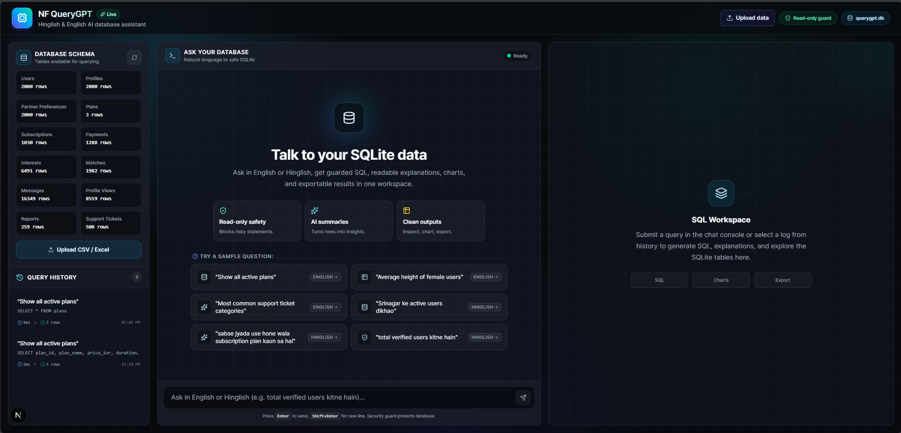
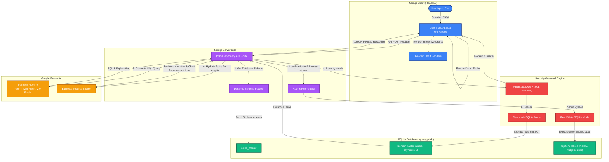

# 🤖 NF QueryGPT — Hinglish & English AI Database Assistant

[](https://nextjs.org/)
[](https://react.dev/)
[](https://sqlite.org/)
[](https://aistudio.google.com/)
[](https://tailwindcss.com/)

> A sleek, premium web-based business intelligence agent. Talk to your SQLite database in natural English, Hindi, or Hinglish, get guarded SQL queries, view readable explanations, see charts, and export results in one unified workspace.

---

## 🎨 Application Showcase

### Developer Banner


### Live Interface Preview


---

## ✨ Key Features

- **🌐 Multilingual Natural Language Processing (English / Hindi / Hinglish)**  
  Understand mixed Hindi-English (Hinglish), pure Hindi, or pure English queries. Try asking:
  - *"Delhi ke active users dikhao"*
  - *"Average height of female users"*
  - *"sabse jyada use hone wala subscription plan kaun sa hai"*
  - *"total verified users kitne hain"*

- **🛡️ Strictly Guarded SQL Execution (Security Shield)**  
  A dual-layered safety mechanism blocks write, update, or destructive statements:
  - **Read-Only SQLite Engine**: Normal database connections are initialized strictly under `sqlite.OPEN_READONLY` mode.
  - **SQL Sanitizer Interceptor**: Parses and blocks queries containing semicolon stacked statements, single-line/multi-line comments bypasses, or destructive SQL keywords (`INSERT`, `UPDATE`, `DELETE`, `DROP`, `ALTER`, `TRUNCATE`, `CREATE`, `PRAGMA`, `ATTACH`, `DETACH`, `VACUUM`, `REPLACE`, `RENAME`).

- **🔄 Resilient Multi-Model Fallback Pipeline**  
  Uses Google Gemini's advanced models (`gemini-2.5-flash` primary, falling back to `gemini-2.0-flash` and `gemini-2.0-flash-lite`) with automatic retries and exponential backoff.

- **📊 AI Business Insights & Interactive Charts**  
  - Generates automatic business summaries, trends, anomalies, and narrative stories.
  - Auto-selects charts (`kpi`, `table`, `bar`, `line`, `pie`, `area`, `heatmap`) based on query return shape and supplies complete UI axis configurations.

- **📌 Interactive Dashboard & Personalized Workspace**  
  - Users can bookmark/favorite queries, edit log names in history, and pin widgets (charts, metrics, tables) directly to their interactive dashboard workspace.
  - Custom data upload: Load SQLite databases or CSV/Excel files into the environment dynamically.

- **👥 Multi-User Role Isolation & Guardrails**  
  - **Admin**: Has full access, can run read-write SQL operations, views global history logs.
  - **User**: Isolated workspace. Access to personal query logs, favorited items, and pinned widgets.
  - **Guest**: Secure anonymous space, query history is ephemeral and isolated.

---

## 🏗️ System Architecture & Data Flow

The flow diagram below details how natural language questions are analyzed, guarded, translated, executed, and visualised in real-time.



---

## 🗃️ Database Entity-Relationship Diagram (ERD)

Below is the database structure. It maps user authorization, query history, and dashboard widgets to the application, alongside the mock business domain tables.

```mermaid
erDiagram
    app_users {
        int id PK
        string username UNIQUE
        string password_hash
        string role
    }

    query_history {
        int id PK
        int user_id FK
        string question
        string sql_query
        int execution_time_ms
        int rows_returned
        string timestamp
        int is_favorite
    }

    pinned_widgets {
        int id PK
        int user_id FK
        string title
        string question
        string sql_query
        string chart_type
        string created_at
    }

    users {
        int user_id PK
        string city
        string gender
        string created_at
    }

    subscriptions {
        int subscription_id PK
        int user_id FK
        string plan_id FK
        string status
        string start_date
        string end_date
    }

    payments {
        int payment_id PK
        int subscription_id FK
        float amount_inr
        string status
        string created_at
    }

    plans {
        string plan_id PK
        string plan_name
        float price_inr
        int duration_days
    }

    app_users ||--o{ query_history : "owns"
    app_users ||--o{ pinned_widgets : "pins"
    users ||--o{ subscriptions : "has"
    plans ||--o{ subscriptions : "defines"
    subscriptions ||--o{ payments : "records"
```

---

## 🚀 Getting Started

### Prerequisites

- **Node.js** (v18.x or above)
- **npm**, **yarn**, or **pnpm**
- **SQLite3** (Automatically configured during boot)

### 1. Clone & Install Dependencies

```bash
git clone https://github.com/anuragsinghrajput123456789/Query_Bot-Sql_chatgpt-.git
cd Query_Bot-Sql_chatgpt-
npm install
```

### 2. Configure Environment Variables

Create a `.env.local` file in the root directory:

```env
# Google Gemini API key (Required)
# Get your API key from Google AI Studio: https://aistudio.google.com/
GEMINI_API_KEY=your_gemini_api_key_here
```

### 3. Build and Start Server

To run in development mode (supports hot-reloading):

```bash
npm run dev
```

To build and compile a production build:

```bash
npm run build
npm run start
```

### 4. Admin Credentials & Seeding

On the first initialization, the system automatically:
- Creates `app_users`, `query_history`, and `pinned_widgets` tables in the database.
- Seeds a default administrator user:
  - **Username**: `admin`
  - **Password**: `admin123`

---

## 🛠️ Technology Stack

- **Framework**: [Next.js 16 (App Router)](https://nextjs.org/)
- **UI & State**: [React 19](https://react.dev/), [Lucide React Icons](https://lucide.dev/)
- **Styling**: [Tailwind CSS 4](https://tailwindcss.com/)
- **Database Engine**: [SQLite3 via Node-sqlite3](https://github.com/TryGhost/node-sqlite3)
- **AI Orchestration**: [@google/genai (Google Gen AI SDK)](https://www.npmjs.com/package/@google/genai)
- **Visuals & Charts**: Custom Responsive Charts & Visualizer Components

---

## 📄 License

This project is open-source and licensed under the MIT License.
